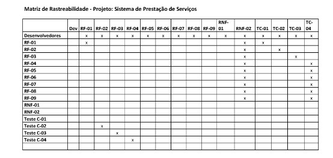
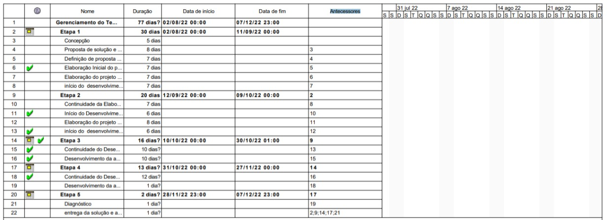
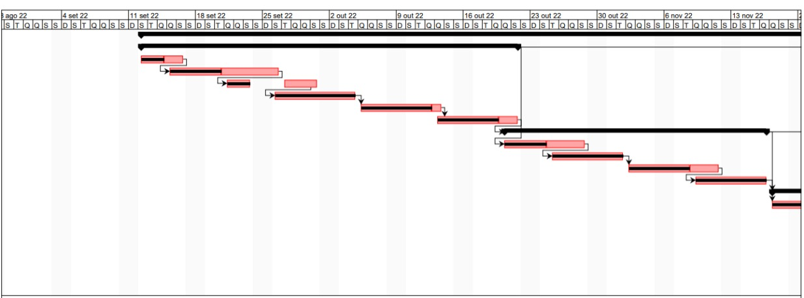
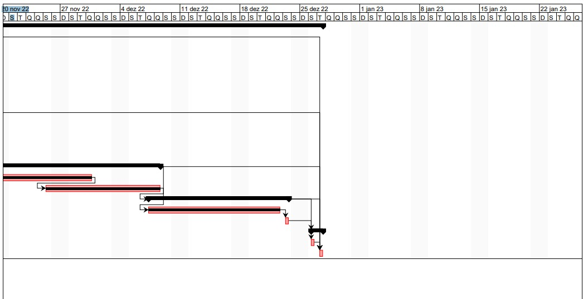
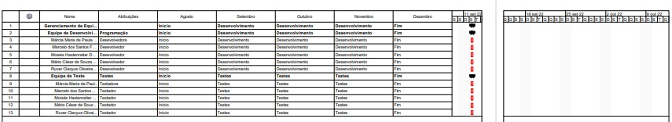
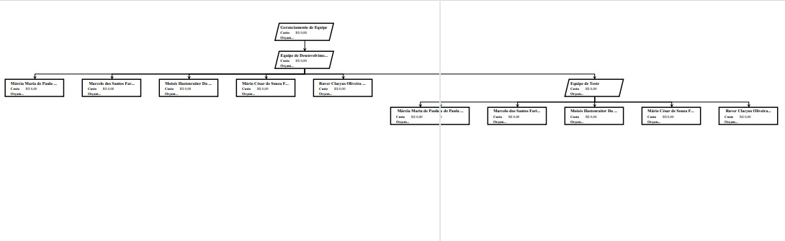
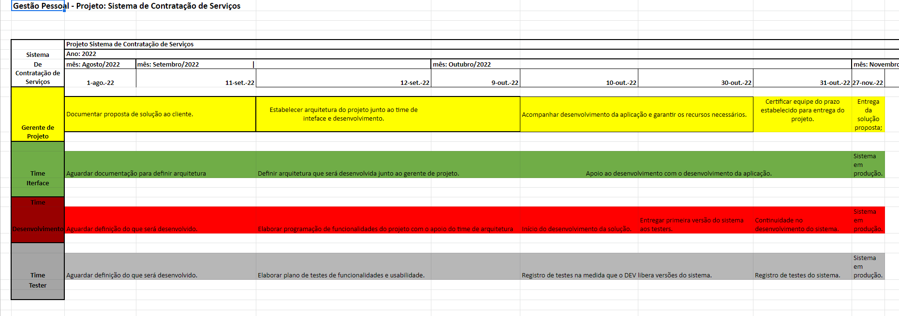

# Especificações do Projeto

A especificação do projeto e os detalhes mais importantes a serem abordados nesta aplicação foram definidas com a participação de clientes e prestadores de serviços onde a necessidade de executar um reparo especifico com qualidade, preço justo e realizado por profissionais qualificados e capacitados, podendo destacar: instalações elétricas, hidráulicas, manutenções de eletrodomésticos, montagem de moveis entre outras. Para auxiliar na intermediação da mão de obra e execução desses serviços necessita-se a realização do desenvolvimento de uma que plataforma que intermedia os valores da mão de obra, formas de pagamento, data, horário e local entre os usuários do sistema. A especificação do projeto foi levantada a partir das experiencias de personas e histórias dos usuários.
 

## Personas:

As personas que ajudaram na criação do processo de entendimento do problema são apresentadas que se seguem. 

## Nome: Carlos Alberto Silva
 - Idade: 65 anos.
 - Ocupação: Aposentado.
 - Aplicativos: Facebook, Instagram, WhatsApp.
 - Motivações: Ter um reparo com eficiência e qualidade nas instalações hidráulicas de sua residência por um preço justo.
 - Frustações: Problema na instalação hidráulica que resulta em vazamento de água. 
 - Hobbies e Historias: Viajar, Dançar forró (pé de serra).

## Nome: José Carlos
 - Idade: 25 anos.
 - Ocupação: Bombeiro hidráulico e Eletricista.
 - Aplicativos: Facebook, Instagram, WhatsApp.
 - Motivações: Prestar serviços com qualidade, Adquirir novos Clientes e novas experiências, garantia de recebimento pelo serviço prestado. 
 - Frustações:Dificuldade em captar novos clientes para seu negócio, não recebimento pelo serviço prestado.
 - Hobbies e Historias: Ir ao cinema, ajudar uma ONG.

## Nome: Rafael Silva 
 - Idade: 49 anos .
 - Ocupação: Administrador do sistema.
 - Aplicativos: Telegram, Facebook, Instagram, MYSQLservar, Visual code, .NET. 
 - Motivações: Administrar o sistema fazer correções de bugs para garantir a qualidade do sistema cadastrar as informações e gerenciá-las. 
 - Frustações: A não funcionalidade do sistema. 
 - Hobbies e Historias: Fazer trilha, Tocar violão.

## Nome: Ana Clara 
 - Idade: 40 anos.
 - Ocupação: Dona de casa.
 - Aplicativos: WhatsApp.
 - Motivações: Montagem da nova estante, rapidez e qualidade e bom acabamento.
 - Frustações: Não conseguir bom montador dentro do curto espaço de tempo. 
 - Hobbies e Historias: Ver series, Se divertir com a família. 
 

## Nome: André Araújo
 - Idade: 35 anos.
 - Ocupação: Montador de moveis.
 - Aplicativos: WhatsApp, Facebook ,Instagram.
 - Motivações: Prestar serviços com qualidade, Adquirir novos Clientes e novas experiências, garantia de recebimento pelo serviço prestado.
 - Frustações: Dificuldade em captar novos clientes para seu negócio, não recebimento pelo serviço prestado.
 - Hobbies e Historias: curtir com a família, viajar, Fazer exercícios físicos na acadêmica.

## Nome: Julia Maria 
 - Idade: 42 anos.
 - Ocupação: Advogada.
 - Aplicativos: WhatsApp, Facebook, Instagram. 
 - Motivações: Babá com boas recomendações, sua filha bem cuidada enquanto realiza seus compromissos. 
 - Frustações: Não poder comparecer ao compromisso no horário marcado.
Hobbies e Historias: Passeios com a família, Caminhadas.

## Nome: Marcia Oliveira 
 - Idade: 28 anos.
 - Ocupação: Baba.
 - Aplicativos: WhatsApp, Facebook, Instagram. 
 - Motivações: Prestar um bom atendimento aos clientes. 
 - Frustações: Não ter uma boa reputação para os serviços prestados. 
 - Hobbies e Historias: Ler livros, Serviços Voluntários. 

## Histórias de Usuários

Com base na análise das personas forma identificadas as seguintes histórias de usuários:

|EU COMO... `PERSONA`| QUERO/PRECISO ... `FUNCIONALIDADE` |PARA ... `MOTIVO/VALOR`                 |
|--------------------|------------------------------------|----------------------------------------|
|Carlos Alberto Silva| Desejo uma ferramenta para encontrar prestadores de serviços na área de Hidráulica.    |Para ter fácil e rápido acesso a trabalhos oferecendo um serviço com qualidade e responsabilidade visando a satisfação do cliente.  
|José Carlos | Desejo oferecer meus serviços em uma plataforma que possa captar novos clientes.             | Para solucionar um problema de vazamento na instalação Hidráulica.               |
|Rafael Silva | Desejo colaborar para o bom funcionamento do sistema atuando na correção de bugs alterações no sistema.|Para satisfazer a demanda dos clientes prestadores de serviço e clientes contratantes de serviços. |
|Ana Clara | Desejo uma ferramenta para encontrar um bom profissional para a montagem do móvel recém adquirido | Para receber uma visita importante com a nova decoração da sala.  |
|André Araújo | Desejo Receber propostas de novos clientes interessados em montagens de moveis.  | Para captar novos clientes e ter maior faturamento.  |
|Julia Maria|Desejo uma ferramenta para encontrar babás para cuidarem de sua filha enquanto estiver ausente. | Para não se preocupar com sua filha enquanto estiver trabalhando. |
|Marcia Oliveira |Desejo oferecer serviços em uma plataforma que ajude a aumentar o número de clientes. | Para ser bem recomendada e aumentar seus ganhos com uma boa carteira de clientes |

## Modelagem do Processo de Negócio 

### Análise da Situação Atual

Apresente aqui os problemas existentes que viabilizam sua proposta. Apresente o modelo do sistema como ele funciona hoje. Caso sua proposta seja inovadora e não existam processos claramente definidos, apresente como as tarefas que o seu sistema pretende implementar são executadas atualmente, mesmo que não se utilize tecnologia computacional. 

### Descrição Geral da Proposta

Apresente aqui uma descrição da sua proposta abordando seus limites e suas ligações com as estratégias e objetivos do negócio. Apresente aqui as oportunidades de melhorias.

### Processo 1 – NOME DO PROCESSO

Apresente aqui o nome e as oportunidades de melhorias para o processo 1. Em seguida, apresente o modelo do processo 1, descrito no padrão BPMN. 

### Processo 2 – NOME DO PROCESSO

Apresente aqui o nome e as oportunidades de melhorias para o processo 2. Em seguida, apresente o modelo do processo 2, descrito no padrão BPMN.

## Indicadores de Desempenho

Apresente aqui os principais indicadores de desempenho e algumas metas para o processo. Atenção: as informações necessárias para gerar os indicadores devem estar contempladas no diagrama de classe. Colocar no mínimo 5 indicadores. 

Usar o seguinte modelo: 

Obs.: todas as informações para gerar os indicadores devem estar no diagrama de classe a ser apresentado a posteriori. 

## Requisitos

As tabelas que se seguem apresentam os requisitos funcionais e não funcionais que detalham o escopo do projeto.

### Requisitos Funcionais

|ID| Descrição  |Prioridade                 |
|--------------------|------------------------------------|----------------------------------------|
|RF-01| O site deve possibilitar ao usuário (cliente e fornecedor de serviços) fazer login, se cadastrar ou alterar sua senha  |Alta|
|RF-02| O site deve conter uma lista pré-estabelecida de serviços que poderão ser selecionados pelo fornecedor de serviços (como serviço oferecido) e pelo cliente (como serviço desejado) | Média|
|RF-03| O site deve permitir ao cliente selecionar um serviço (da lista pré-estabelecida) e solicitar seu orçamento, podendo também adicionar informações sobre o serviço requerido  | Alta |
|RF-04| O site deve permitir ao fornecedor enviar prosposta| Alta|
|RF-05| O site deve permitir ao cliente o agendamento do serviço escolhido após ter recebido e aprovado o orçamento do mesmo | Alta | 
|RF-06| O site deve permitir ao cliente adicionar o serviço (com seu orçamento previamente aprovado) a uma lista de serviços/carrinho de compras | Alta |
|RF-07| O site deve permitir ao cliente efetuar o pagamento pelo serviço(s) prestado(s) | Média | 
|RF-08| O site deve permitir ao cliente realizar a avaliação do serviço prestado pelo fornecedor | Baixa|
|RF-09| O site deve permitir ao fornecedor o recebimento online pelo serviços prestados |Alta| 
|RF-10| O site deve permitir ao cliente visualizar o contato e as avaliações referentes aos fornecedores| Baixa|
### Requisitos não Funcionais

|ID     | Descrição do Requisito  |Prioridade |
|-------|-------------------------|----|
|RNF-001| O sistema deve ser responsivo para rodar em um dispositivos móvel | MÉDIA | 
|RNF-002| Deve processar requisições do usuário em no máximo 3s |  BAIXA | 

Com base nas Histórias de Usuário, enumere os requisitos da sua solução. Classifique esses requisitos em dois grupos:

- [Requisitos Funcionais
 (RF)](https://pt.wikipedia.org/wiki/Requisito_funcional):
 correspondem a uma funcionalidade que deve estar presente na
  plataforma (ex: cadastro de usuário).
- [Requisitos Não Funcionais
  (RNF)](https://pt.wikipedia.org/wiki/Requisito_n%C3%A3o_funcional):
  correspondem a uma característica técnica, seja de usabilidade,
  desempenho, confiabilidade, segurança ou outro (ex: suporte a
  dispositivos iOS e Android).
Lembre-se que cada requisito deve corresponder à uma e somente uma
característica alvo da sua solução. Além disso, certifique-se de que
todos os aspectos capturados nas Histórias de Usuário foram cobertos.

## Restrições

O projeto está restrito pelos itens apresentados na tabela a seguir.

|ID| Restrição                                             |
|--|-------------------------------------------------------|
|01| O projeto deverá ser entregue até o final do semestre |
|02| Não pode ser desenvolvido um módulo de backend        |

Enumere as restrições à sua solução. Lembre-se de que as restrições geralmente limitam a solução candidata.

> **Links Úteis**:
> - [O que são Requisitos Funcionais e Requisitos Não Funcionais?](https://codificar.com.br/requisitos-funcionais-nao-funcionais/)
> - [O que são requisitos funcionais e requisitos não funcionais?](https://analisederequisitos.com.br/requisitos-funcionais-e-requisitos-nao-funcionais-o-que-sao/)

## Diagrama de Casos de Uso

O diagrama de casos de uso é o próximo passo após a elicitação de requisitos, que utiliza um modelo gráfico e uma tabela com as descrições sucintas dos casos de uso e dos atores. Ele contempla a fronteira do sistema e o detalhamento dos requisitos funcionais com a indicação dos atores, casos de uso e seus relacionamentos. 

As referências abaixo irão auxiliá-lo na geração do artefato “Diagrama de Casos de Uso”.

> **Links Úteis**:
> - [Criando Casos de Uso](https://www.ibm.com/docs/pt-br/elm/6.0?topic=requirements-creating-use-cases)
> - [Como Criar Diagrama de Caso de Uso: Tutorial Passo a Passo](https://gitmind.com/pt/fazer-diagrama-de-caso-uso.html/)
> - [Lucidchart](https://www.lucidchart.com/)
> - [Astah](https://astah.net/)
> - [Diagrams](https://app.diagrams.net/)

# Matriz de Rastreabilidade

A matriz de rastreabilidade é uma ferramenta usada para facilitar a visualização dos relacionamento entre requisitos e outros artefatos ou objetos, permitindo a rastreabilidade entre os requisitos e os objetivos de negócio. 

A matriz deve contemplar todos os elementos relevantes que fazem parte do sistema, conforme a figura meramente ilustrativa apresentada a seguir.

> **Links Úteis**:
> - [Artigo Engenharia de Software 13 - Rastreabilidade](https://www.devmedia.com.br/artigo-engenharia-de-software-13-rastreabilidade/12822/)
> - [Verificação da rastreabilidade de requisitos usando a integração do IBM Rational RequisitePro e do IBM ClearQuest Test Manager](https://developer.ibm.com/br/tutorials/requirementstraceabilityverificationusingrrpandcctm/)
> - [IBM Engineering Lifecycle Optimization – Publishing](https://www.ibm.com/br-pt/products/engineering-lifecycle-optimization/publishing/)

# Gerenciamento de Projeto

De acordo com o PMBoK v6 as dez áreas que constituem os pilares para gerenciar projetos, e que caracterizam a multidisciplinaridade envolvida, são: Integração, Escopo, Cronograma (Tempo), Custos, Qualidade, Recursos, Comunicações, Riscos, Aquisições, Partes Interessadas. Para desenvolver projetos um profissional deve se preocupar em gerenciar todas essas dez áreas. Elas se complementam e se relacionam, de tal forma que não se deve apenas examinar uma área de forma estanque. É preciso considerar, por exemplo, que as áreas de Escopo, Cronograma e Custos estão muito relacionadas. Assim, se eu amplio o escopo de um projeto eu posso afetar seu cronograma e seus custos.

## Gerenciamento de Tempo

Com diagramas bem organizados que permitem gerenciar o tempo nos projetos, o gerente de projetos agenda e coordena tarefas dentro de um projeto para estimar o tempo necessário de conclusão.

O gráfico de Gantt ou diagrama de Gantt também é uma ferramenta visual utilizada para controlar e gerenciar o cronograma de atividades de um projeto. Com ele, é possível listar tudo que precisa ser feito para colocar o projeto em prática, dividir em atividades e estimar o tempo necessário para executá-las.

## Gerenciamento de Equipe

O gerenciamento adequado de tarefas contribuirá para que o projeto alcance altos níveis de produtividade. Por isso, é fundamental que ocorra a gestão de tarefas e de pessoas, de modo que os times envolvidos no projeto possam ser facilmente gerenciados. 

## Gestão de Orçamento

O processo de determinar o orçamento do projeto é uma tarefa que depende, além dos produtos (saídas) dos processos anteriores do gerenciamento de custos, também de produtos oferecidos por outros processos de gerenciamento, como o escopo e o tempo.

Orçamentária.jpeg)

## Gestão de Pessoal

