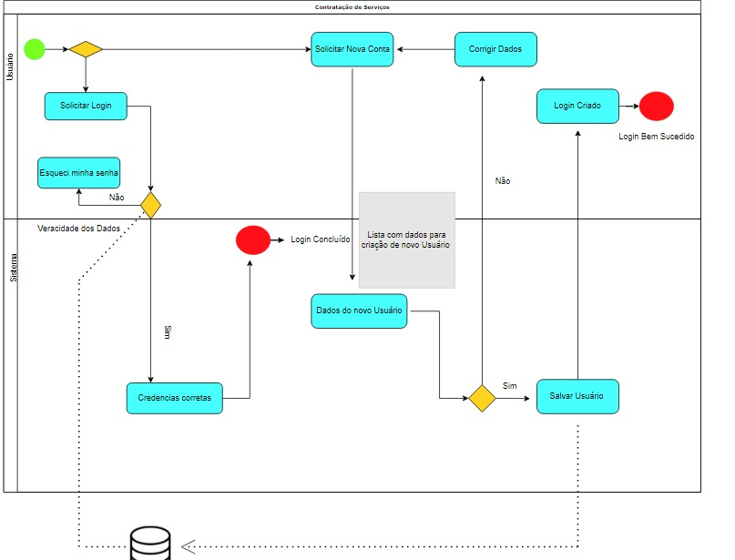
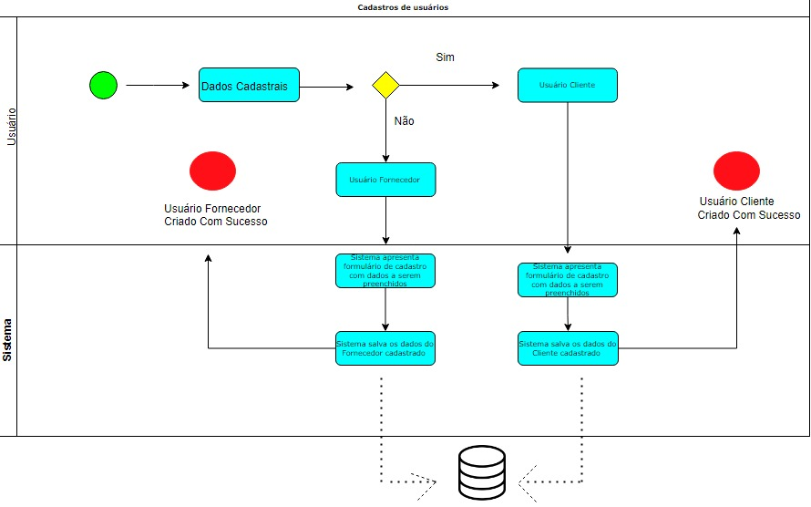
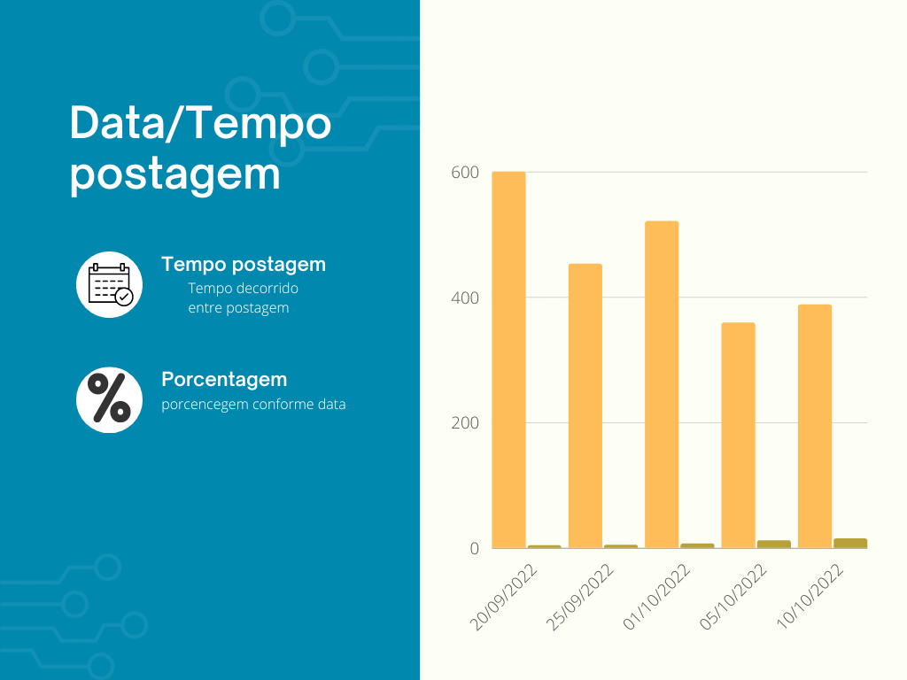
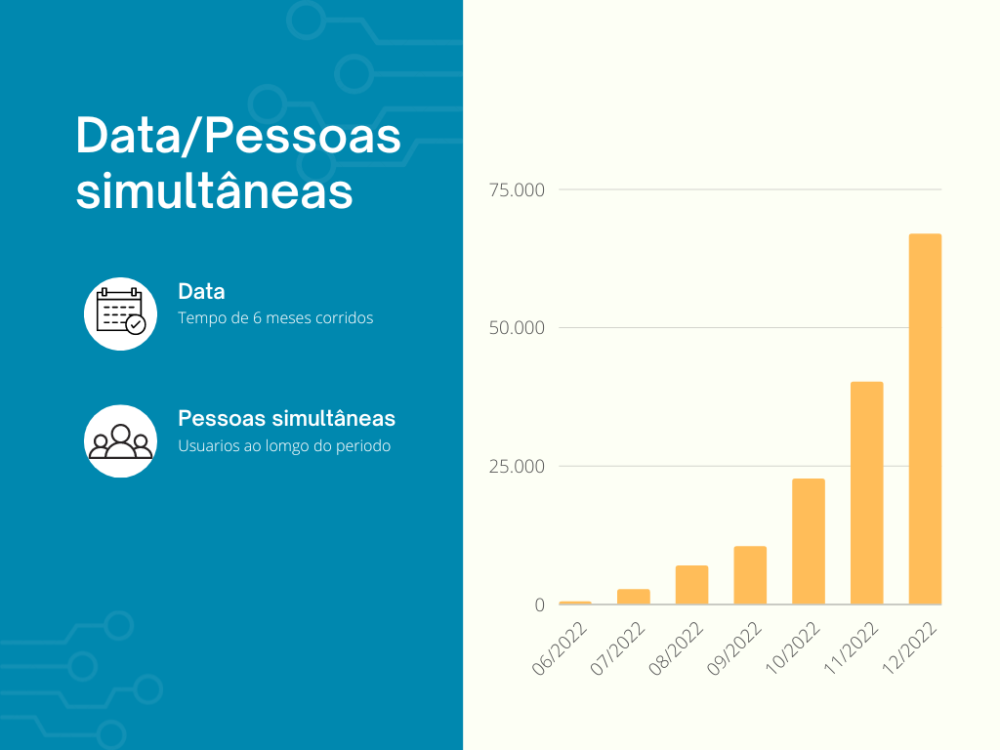
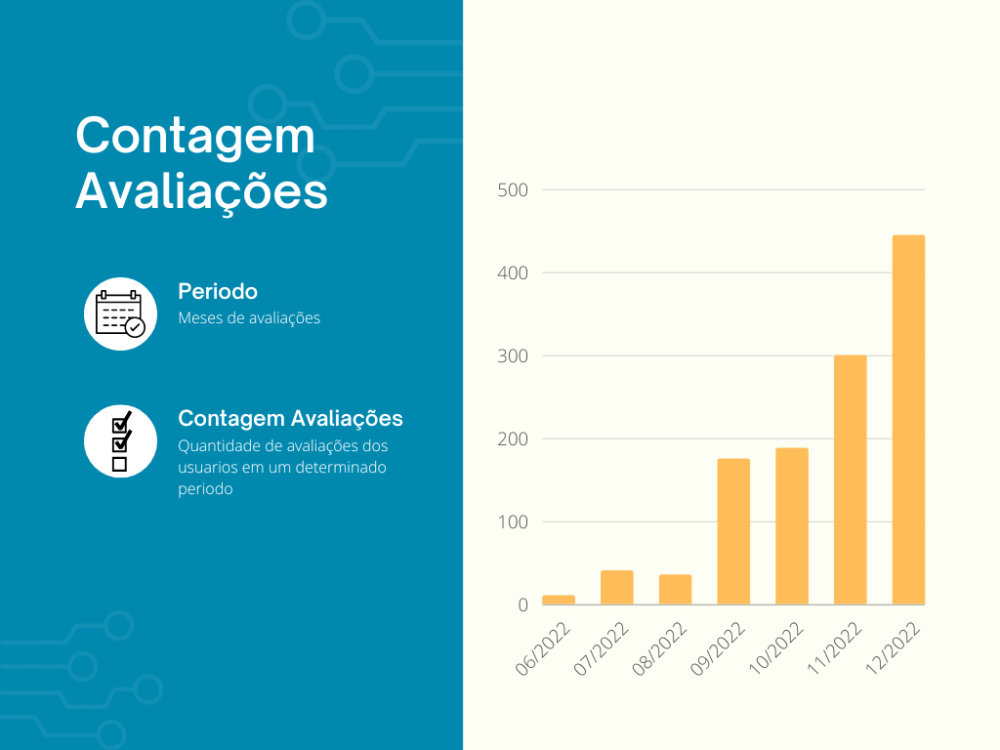
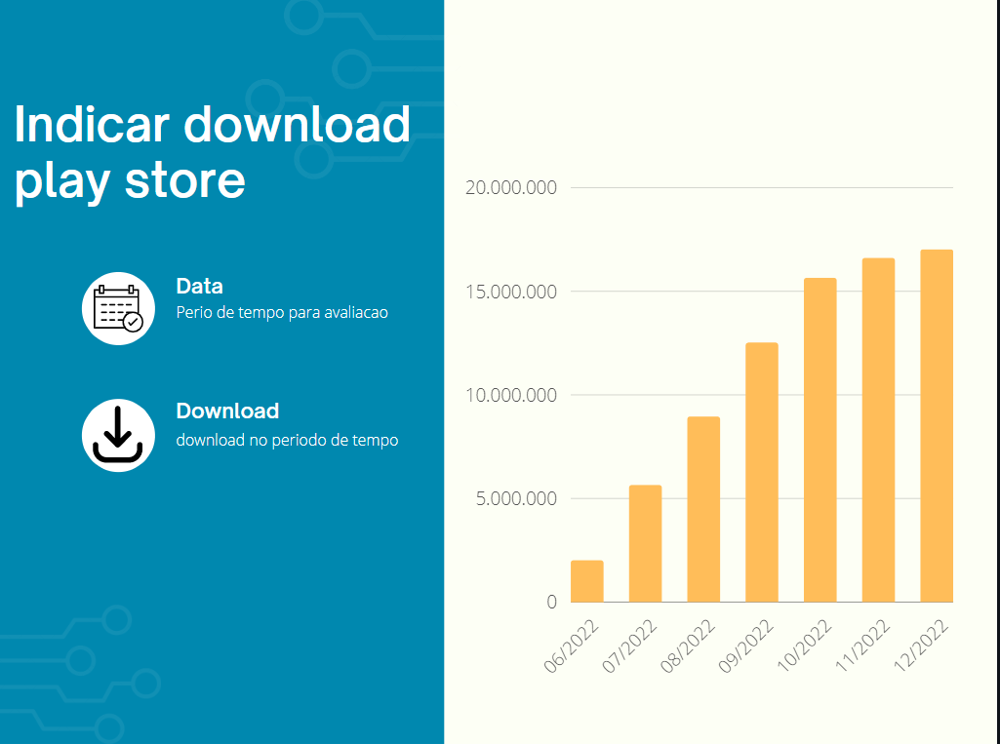
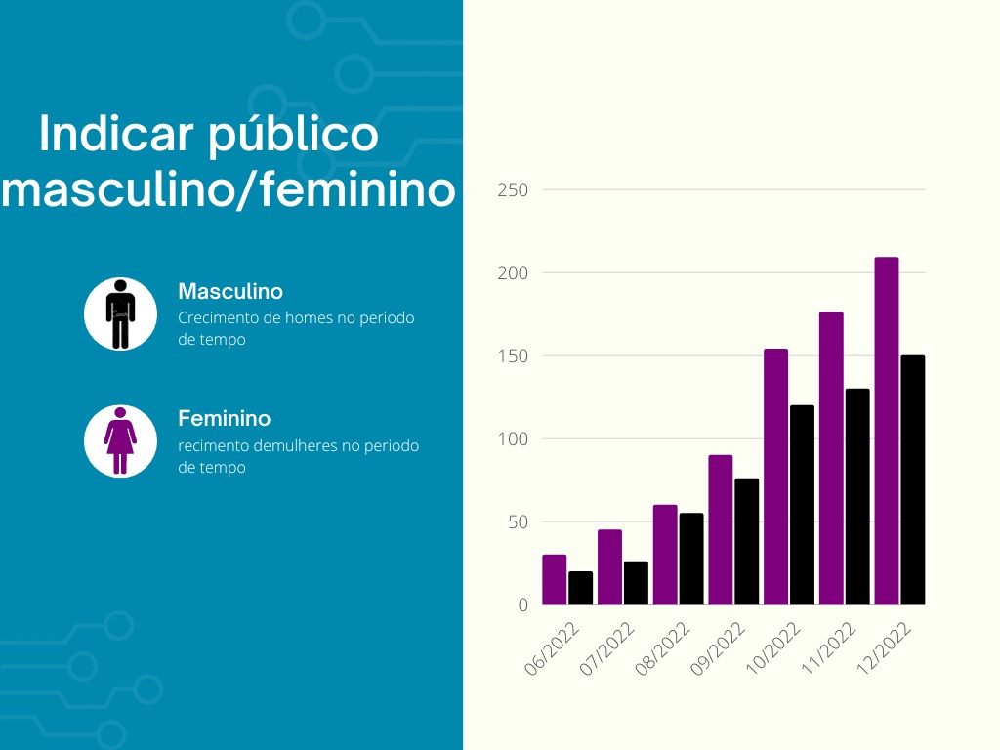

# Modelagem do Processo de Negócio

Os processos abaixo descrevem a ordem de execução lógica de cada função do sistema.
 

## Descrição Geral da Proposta:

Apresente aqui uma descrição da sua proposta abordando seus limites e suas ligações com as estratégias e objetivos do negócio. Apresente aqui as oportunidades de melhorias. 

##  Possibilitar ao usuário (cliente e fornecedor de serviços) fazer login, se cadastrar ou alterar sua senha: 
Abrange o requisito: RF-

. 

## Possibilibitar o usuário se cadastrar como (cliente ou fornecedor de serviços) : 
Abrange o requisito: RF-

. 

##  Permitir ao cliente visualizar o contato e as avaliações referentes aos fornecedores: 
Abrange o requisito: RF-

. 

## Permitir ao cliente realizar a avaliação do serviço prestado pelo fornecedor: 
Abrange o requisito: RF-

. 

## Permitir ao cliente o agendamento do serviço escolhido após ter recebido e aprovado o orçamento do mesmo: 
Abrange o requisito: RF-

. 

## Permitir ao fornecedor enviar prosposta: 
Abrange o requisito: RF-

. 

# Indicadores de Desempenho

## Data/Tempo postagem: 

. 

## Data/Pessoas simultâneas: 

. 

## Contagem Avaliações: 

. 

## Data / Indicar download play store: 

. 

## Indicar público masculino / feminino: 

. 

